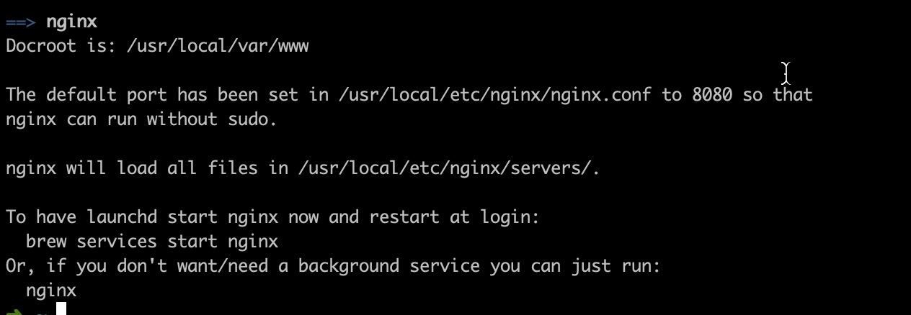

### 1.下载对应的nginx版本
```
nginx-install.tar
```

### 2.解压文件

```
tar -xf nginx-install.tar
```

### 3.进入解压好的目录执行配置命令

```
./configure
```

### 4.根据情况安装其它依赖（CentOS7）
[参考链接](http://www.souvc.com/?p=1661)

注意：安装完毕后再次进行执行配置命令
```
./configure
```


### 5.安装完成后进行编译

```
make install
```
### 6.查找安装路径

```
whereis nginx
```
### 7.启动、停止nginx

```
cd 你的安装路径
./nginx 
./nginx -s stop
./nginx -s quit 此方式停止步骤是待nginx进程处理任务完毕进行停止。
./nginx -s reload 此方式相当于先查出nginx进程id再使用kill命令强制杀掉进程。
./nginx -t 查看nginx状态
```

### mac下安装
#### 主页的路径，和对应配置文件的路径


执行`nginx`，后在浏览器输`http://localhost:8080/`会看到


### 修改对应的文件
```
/usr/local/etc/nginx/nginx.conf 


    server {
         listen       80;
         server_name  www.yourdomain.com;
         location / {
             root  静态文件存放路径;
             index index.html;
         }
     }

```