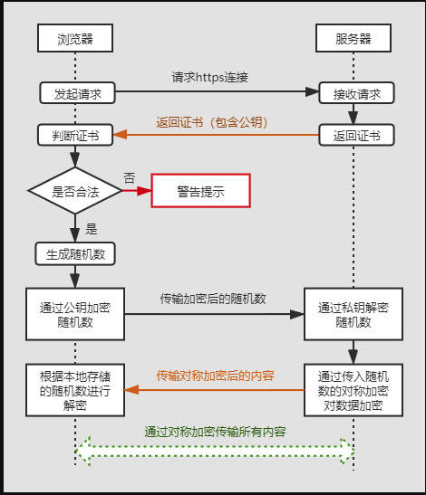

## HTTP 、HTTPS

### HTTP 协议是什么？有哪些特点？

+ header + body 结。 **起始行 + 头部 + 空行 + 实体**

```http
# 起始行 方法 + 路径 + 版本号
GET /home HTTP/1.1
```

### GET 和 POST 的区别

`GET` 和 `POST` 是 `HTTP` 协议中的两种发送请求的方法。 

`HTTP` 是基于 `TCP/IP` 的关于数据如何在万维网中如何通信的协议 。`HTTP` 的底层是 `TCP/IP`。所以`GET` 和 `POST` 的底层也是 `TCP/IP`。`GET` 和 `POST` 能做的事情是一样一样的。你要给 `GET` 加上`request body`，给 `POST` 带上 `url` 参数，技术上是完全行的通的。

一般的区别都是浏览器层面的限制，根据不同的浏览器对应的限制也不同。

简单来说：

**GET 产生一个 TCP 数据包；POST 产生两个 TCP 数据包**

正常来说：

对于 `GET` 方式的请求，浏览器会把 `http header` 和 `data` 一并发送出去，服务器响应 `200`（返回数据）。

而对于 `POST`，浏览器先发送 `header`，服务器响应`100 continue`，浏览器再发送 `data`，服务器响应 `200 ok`（返回数据）。<small>并不是所有浏览器都会在POST中发送两次包，`Firefox` 就只发送一次</small>

**options 请求**

跨域并写了自定义请求头就会发 `OPTIONS`

MDN的[CORS](https://developer.mozilla.org/zh-CN/docs/Web/HTTP/Access_control_CORS)一文中提到：

>规范要求，对那些可能对服务器数据产生副作用的 HTTP 请求方法（特别是 GET 以外的 HTTP 请求，或者搭配某些 MIME 类型的 POST 请求），浏览器必须首先使用 OPTIONS 方法发起一个预检请求（preflight request），从而获知服务端是否允许该跨域请求。

触发的条件：

+  使用了**PUT/DELETE/CONNECT/OPTIONS/TRACE/PATCH** 任一 `HTTP` 方法。
+ `Content-Type` 的值**不属于**下列之一:
  + `application/x-www-form-urlencoded、multipart/form-data、text/plain`
  + 我们有时候会设置为 `application/json`

如何避免：

可以使用第三方库 `axios` 等。避免触发上述条件。

**application/x-www-form-urlencoded 和 multipart/form-data 区别**

+ `x-www-form-urlencoded`，表单默认的 Content-type 类型，支持 ASCII-text 文本内容

  转化前

  ```http
  param1:website
  param2:https://www.google.com
  ```

  转化后

  ```http
  param1=website&param2=https%3A%2F%2Fwww.google.com
  ```

  

+ `multipart/form-data`，允许提交表单包含： files，non-ASCII-text，Binary(二进制) 类型数据


### HEAD

HEAD 方法和 GET 方法一样，只是不返回报文的主题。用于确认 URI 的有效性及资源的更新日期等。

### DELETE

DELETE 方法按请求的 URI 删除指定的文件

## HTTPS

> 出现是为了解决 HTTP 明文传输带来的安全性问题，因在 HTTP 传输的过程中任何人都可以截获，修改等。HTTPS 提供了三个保障：加密（客户端和服务端交互），数据一致性（传输的数据一致），身份认证（防止中间人攻击）。

**HTTP 请求数据传输存在的问题：**

+ 明文传输等于裸奔  
+ 对称加密：加解密是一套 `key` 也等于裸奔
+ 非对称加密：客户端可以拿公钥对数据加密传输到服务端，但是反过来不行，服务端到客户端数据不安全。

**解决办法：HTTPS**

**HTTP + TSL(SSL) = HTTPS** 相当于在 `HTTP` 外面套了一层 `SSL` ，`HTTP` 先和 `TSL` 通信，`TLS` 在根本上使用`对称加密`和 `非对称加密` 两种形式。`TLS` 是一个双向验证的过程，握手正式结束后，`HTTP` 才开始正式的加密报文传输。

*传输层安全性(`TLS`)，安全套接字层(`SSL`)。`TLS` 是 `SSL` 的后续版本。它们是用于计算机之间的身份验证和传输加密数据的一种协议*。

**安全通信机制**



安全通信机制流程详解：

1. 客户端发送 https 请求，把自身支持的秘钥算法套件（SSL 指定版本、加密组件列表）发送给服务器
2. 服务器判断自身是否支持该算法套件，如果支持则返回证书信息(本质为公钥，包含了证书颁发机构，网址，过期时间等) ，否则断开连接，
3.  客户端解析证书(通过 TLS 协议来完成)，验证证书是否有效。如果异常，则会提示是否安装证书，常见的就是浏览器搜索栏左侧出现“X”告警按钮等。
4.  如果证书有效、或者是授信安装证书后，开始传送加密信息(用证书加密后的随机值，供加解密使用)
5.  客户端生成随机值。客户端用服务端的**公钥**加密该随机值，并将加密后的结果发送给服务端，服务端通过私钥解密加密信息，得到客户端发送来的随机值，然后把内容通过该值进行对称加密。这样一来，除非知道私钥，否则是无法获取加密内容的。
6.  服务端返回加密后的内容
7. 客户端通过前面提到的随机值对加密信息进行解密

##### 证书验证过程

SSL 证书中包含的具体内容有证书的颁发机构、有效期、公钥、证书持有者、签名，通过第三方的校验保证了身份的合法

1. **检验基本信息**：首先浏览器读取证书中的证书所有者、有效期等信息进行一一校验
2. **校验 CA 机构**：浏览器开始查找操作系统中已内置的受信任的证书发布机构 CA，与服务器发来的证书中的颁发者 CA 比对，用于校验证书是否为合法机构颁发；如果找不到，浏览器就会报错，说明服务器发来的证书是不可信任的。
3. **解密证书**：如果找到，那么浏览器就会从操作系统中取出 颁发者 CA 的公钥，然后对服务器发来的证书里面的签名进行解密
4. **比对 hash 值**：浏览器使用相同的 hash 算法计算出服务器发来的证书的 hash 值，将这个计算的 hash 值与证书中签名做对比
5. 对比结果一致，则证明服务器发来的证书合法，没有被冒充
6. 此时浏览器就可以读取证书中的公钥，用于后续加密了


**非对称加密的特点：**

+ 公钥加密私钥解密，例如：任何经过 A 服务公钥加密的信息，只有 A 服务的私钥才能解密。

服务端拿到客户端的随机字符串后生成对层加密的 `key`

+ 任何有公钥的人可以确认对方发送的信息是否被加密过的。
  + 一般访问 `https` 网站，服务器会向客户端发送由 `CA` 签名认证的公钥信息。
  + 客户端拿到公钥对请求到服务端的字段（随机字符）进行公钥加密
  + 服务端用私钥解密客户端发来的随机字符，作为对称加密的 `key` 

`HTTPS` 存在的问题：中间人劫持，它代理了服务端。

+ 在客户端和服务端中间用自己的公钥私钥进行劫持数据，转发客户端和服务端请求
+ 记录客户端和服务端的通信数据，进行篡改。

**解决方案：CA**

因为客户端不知道拿到的公钥到底是服务端的还是中间人的。服务端用 `CA` 认证生成 `license` ,发给客户端，浏览器存了在大量的 `CA` 机构的公钥，对拿到的公钥进行验证。

**细节：客户端服务端协商的过程是怎么样的？**

+ 客户端请求服务端会携带 `SSL` 版本、非对称加密算法、随机数1
+ 服务端采用客户端的 `SSL` 版本、发送对称算法、随机数2、证书
+ 客户端认证证书
+ 客户端发送随机数3、hash(含第一步、第二步的数据)，上传到服务端。
+ 服务端检查客户端发来的 hash 是否和前两步发来的 hash 一致 ，根据协商一致的算法三个随机数生成 key 
+ 服务端采用散列算法生成 hash(随机数1，随机数2，随机数3)
+ 客户端也生成  hash(随机数1，随机数2，随机数3) 生成一个 key 服务端的 key 和 客户端的 key 均不在网络上传输，做本地校验使用。

**刷新页面不需要重新建立 SSL 连接？**

`TCP` 连接有的时候会被浏览器和服务端维持一段时间。`TCP` 不需要重新建立，`SSL` 自然也会用之前的。

**总结：**

`HTTPS` 采用了非对称加密 + 对称加密 + `CA` + `hash` 算法 


## HTTP 各个版本的区别是什么

*解决了哪些问题？比如头部缩减的优化，那你了解这个优化的具体策略吗？缩减了什么？又增加了什么？要深挖细节。多路复用，是怎么多路复用的？*


HTTP 1.0 短连接，带来的问题。

如果有 100 张图片，要发送 100 次请求，需要 100 次的 TCP 握手和挥手，消耗性能。

**http 1.1 长连接**，只需要一次 TCP 握手和挥手。

HTTP/1.1 有两个主要的缺点：**安全不足和性能不高**。

```http
connection:keep-alive;
```

**`TCP` 连接后是否会在一个 `HTTP` 请求完成后断开？什么情况下会断开？一个 `TCP` 连接可以对应几个 `HTTP` 请求？**

`HTTP 1.0` 会断开，`HTTP 1.1` 请求一个数据后可以不关闭连接继续请求其它数据。除非请求中写明 `Connection: close` 。在同一个连接中完成多个请求，上一个请求成功或者是失败后才会进行下一个请求。

**一个 `TCP` 连接中 `HTTP` 请求发送可以一起发送么（同步请求）？**

单个 `TCP` 连接在同一时刻只能处理一个请求，意思是说：两个请求的生命周期不能重叠，任意两个 `HTTP` 请求从开始到结束的时间在同一个 `TCP` 连接里不能重叠。

<small>在 HTTP/1.1 存在 Pipelining 技术可以完成这个多个请求同时发送，但是由于浏览器默认关闭，需要服务器按顺序返回请求</small>

为了提高页面加载效率，浏览器也可以同时向服务器建立多个 `TCP` 连接，不过是有限制的 `Chrome `对同一域名的请求一般是 `6` 个。如果有 `12` 个请求是需要等前 `6` 个完成后后面 `6` 个才可以建立连接请求。


**http 2.0 长连接 + io 多路复用模型**

**HTTP/2是基于二进制“帧”的协议，HTTP/1.1是基于“文本分割” （key:value）解析的协议。** 

> HTTP/2基于SPDY，专注于性能，最大的一个目标是在用户和网站间只用一个连接（connection），使用HTTP/2能带来20%~60%的效率提升。

解决的问题：

1. 明文，改成二进制传输。

2. 传输，改成单连接 + 帧

3. header 太长 ，HTTP 2.0 以二进制方式传输和 Header 压缩。

   建立索引表让请求头字段得到极大程度的精简和复用。

   我们用 `BT`下载，下载电视剧合集的时候不是一集一集的下载而是把资源打散成一个个块，每个块在客户端和服务端之间都是平等的，大家交错传输，传输完后客户端再进行重组。

   在 `HTTP2.0` 中原来的`Header+Body`的消息**打散**为数个小片的二进制"帧，用**Headers帧**存放头部字段，**Data帧**存放请求体数据，请求和响应多路复用，交错传输，请求完成后在另一端组装。

   所以 `HTTP2.0` 很好的解决了浏览器限制同一个域名下的请求数量的问题，同时也更容易实现全速传输，一次请求完成（html css js 下载到浏览器）。

4. server 主动 push ，服务器推送

**HTTP2.0 多路复用**

> 多路复用中是基于二进制数据帧的传输、消息、流，所以可以做到乱序的传输。
>
> 多路复用对同一域名下所有请求都是基于流，所以不存在同域并行的阻塞。

多路复用代替原来的序列和阻塞机制，所有就是请求的都是通过一个 `TCP` 连接并发完成。同一个域名下的所有通信都在一个连接上完成，只需要占用一个 `TCP` 连接，这个连接可以承载任意流量的双向数据流，可以并行的交错传输请求和响应，互补干扰。

数据流以消息的形式发送，而消息又由一个或多个帧组成，多个帧之间可以乱序发送，因为可以根据帧首部的流标识进行重新组装。每个请求都可以携带一个标识优先级的

**帧 + 流**

帧是 `HTTP2.0` 数据传输的最小单元。每个帧会标识出属于哪个流，流也是由多个帧组成的数据流。

`HTTP2.0` 长连接中的数据包是不按请求-响应顺序发送的，一个完整的请求或响应称一个数据流 `stream `。流可以承载双向消息，每个流都有一个唯一的整数` ID` ，客户端发起的 `ID` 是奇数，服务端发起的 `ID` 是偶数。


**HTTP 3.0**

http3 基于 UDP 的 Quic  

QUIC 基于 UDP 实现，是 HTTP/3 中的底层支撑协议，该协议基于 UDP，又取了 TCP 中的精华，实现了既快又可靠的协议

+ HTTP 2 新特性

  + 流量控制
  + 重置消息
  + 多路复用
  + HTTP/2 使用 TCP 协议来传输的，而如果使用 HTTPS 的话，还需要使用 TLS 协议进行安全传输，而使用TLS也需要一个握手过程，**这样就需要有两个握手延迟过程**：

  

7. URI和URL的区别？
    + URI是`Uniform Resource Identifier`的缩写,统一资源标识符,即由某个协议方案表示的资源的定位标识符
    + URI 用字符串标识某一互联网资源，而 URL表示资源的地点（互联网上所处的位置）。可见 URL是 URI 的子集<br>
    + URI的例子
    
    + 绝对URI的格式,遵循以下规则。
    
## HTTP 进阶

#### 网页中的图片资源为什么分放在不同的域名下?

浏览器对并发请求的数目限制是针对域名的，即针对同一域名（包括二级域名）在同一时间支持的并发请求数量的限制。如果请求数目超出限制，则会阻塞。因此，网站中对一些静态资源，使用不同的一级域名，可以提升浏览器并行请求的数目，加速界面资源的获取速度。

#### 一个 TCP 连接可以同时发送几个 HTTP 请求？

`HTTP/1.1`中，单个TCP连接，在同一时间只能处理一个http请求，虽然存在Pipelining技术支持多个请求同时发送，但由于实践中存在很多问题无法解决，所以浏览器默认是关闭，所以可以认为是不支持同时多个请求。

`HTTP2`提供了多路传输功能，多个http请求，可以同时在同一个TCP连接中进行传输。

#### 浏览器http请求的并发性是如何体现的？并发请求的数量有没有限制？

页面资源请求时，浏览器会同时和服务器建立多个 TCP 连接，在同一个 TCP 连接上顺序处理多个HTTP 请求。所以浏览器的并发性就体现在可以建立多个 TCP 连接，来支持多个 http 同时请求。

Chrome 浏览器最多允许对同一个域名 Host 建立6个 TCP 连接，不同的浏览器有所区别。

+ 说说Http协议的工作流程
+ Http请求报文与响应报文的格式？
+ Http首部包含哪些字段？举例说明
+ Https的原理是什么？
+ 浅析Http和Https的三次握手有什么区别。
+ 谈谈Session/cookie机制，如何实现会话跟踪？
+ 什么是Web缓存？原理如何？
+ OSI有哪七层模型？TCP/IP是哪四层模型。
+ 讲一讲TCP协议的三次握手和四次挥手流程。
+ 为什么TCP建立连接协议是三次握手，而关闭连接却是四次握手呢？为什么不能用两次握手进行连接？
+ websockt是什么？和Http有什么区别？
+ 什么是非持久连接，什么是持久连接？
  + 在`HTTP/1.0`中，一个http请求收到服务器响应后，会断开对应的TCP连接。这样每次请求，都需要重新建立TCP连接，这样一直重复建立和断开的过程，比较耗时。所以为了充分利用TCP连接，可以设置头字段`Connection: keep-alive`，这样http请求完成后，就不会断开当前的TCP连接，后续的http请求可以使用当前TCP连接进行通信。
  + 默认情况下建立的TCP连接不会断开，只有在请求头中设置`Connection: close`才会在请求后关闭TCP连接。
+ Keep-Alive: timeout=5, max=100是什么意思？
+ http1.0，http1.1，http2.0区别（HTTP1.1版本新特性？HTTP2版本新特性？）
+ 对Http代理做个介绍？
+ 常见的鉴权方式有哪些？
+ http 2 http3
  + 以富媒体（如图片、声音、视频）

## HTTP Auth 验证

Authorization  401 ，没有带认证或认证信息错误

Forbidden 403，带有认证信息但是服务端认为认证信息对应的用户没有对应资源的访问权限

二者都可以理解为权限不足

**Authorization：**

作为 HTTP 的 Header 每次携带用户信息去请求资源。

+ Basic 方法 Base64 编码用户信息发送到服务端 

  

+ Bearer 方式 token 的模式

  ```http
  eyJhbGciOiJSUzI1NiIsInR5cCI6IkpXVCJ9; base64 解码 {"alg":"RS256","typ":"JWT"}
  ```

  

## HTTP 缓存

客户端向服务器请求资源，服务器返回响应的时候，会返回一组描述响应的内容类型、长度、缓存指令、验证令牌的 HTTP 标头。


上图表示：

+ 返回一个 `1024` 字节的响应
+ 客户端最多缓存 `120s`
+ 提供一个验证令牌 `x234dff` 用于在响应过期后检查资源是否被修改
  + 这个令牌一般是文件内容的 `hash` 或其它指纹

### 通过 Etag 验证缓存的响应

以上图为例：客户端在 120s 对同一资源又发起了请求，会在`If-None-Match`带上这个 `Etag` 发送到服务器，如果指纹未发送改变，服务器会返回 `304 Not Modified` 响应，告知浏览器缓存中的响应未发生改变，可以继续延用 120s 。这样就不用再次下载数据，直接用浏览器自身的缓存就可以。


### Cache-Control

> Cache-Control 指令控制谁在什么条件下可以缓存响应以及可以缓存多久

```js
// express 设置响应的缓存
res.setHeader('Cache-Control', 'no-cache')
res.setHeader('Cache-Control', 'no-store')
next()
```

#### no-cache

表示客户端必须先于服务器确定返回的响应是否发生了变化，通过 etag 验证资源是否发生了改变，然后才能使用该响应。如果为发生改变则不用下载直接使用浏览器的缓存。

#### no-store

禁止浏览器缓存服务器的响应。

#### public

`public` 不是必需的，因为明确的缓存信息（例如 `max-age`）已表示响应是可以缓存的。

#### private

浏览器可以缓存 `private` 响应，但是这是只为单个用户的缓存，不允许中间缓存对其缓存，例如 `CDN` 不能缓存。

#### max-age

从请求时间开始，允许响应缓存的最长时间（秒）。

```js
res.setHeader('Cache-Control', 'public, max-age=86400'); // 一天
```

#### 最佳缓存策略

理想情况下客户端应该尽可能多的缓存响应，缓存尽可能长的时间。并未每个响应提供令牌，实现高效的验证。

#### 废弃和更新缓存

如果你设置了缓存时间，那么在这个缓存时间内资源发生了更新咋办？

变更文件名，webpack chunk name，强制用户下载更新。这个时候请求地址变了肯定需要从新请求。

### 	强缓存、协商缓存

#### 强缓存

浏览器在加载资源时，根据请求头的`expires`和`cache-control`判断是否命中强缓存，是则直接从缓存读取资源，不会发请求到服务器。

```
Expires: Wed, 11 May 2018 07:20:00 GMT
// 或
Cache-Control: max-age=315360000
```

#### 协商缓存

如果没有命中强缓存，浏览器一定会发送一个请求到服务器，通过`last-modified`和`etag`验证资源是否命中协商缓存，如果命中，服务器会将这个请求返回，但是不会返回这个资源的数据，依然是从缓存中读取资源 304。

+ `Last-Modified` 表示本地文件最后修改日期，浏览器会在request header加上`If-Modified-Since`（上次返回的`Last-Modified`的值），询问服务器在该日期后资源是否有更新，有更新的话就会将新的资源发送回来
+ 但是如果在本地打开缓存文件，就会造成 `Last-Modified` 被修改，所以在 `HTTP / 1.1` 出现了 `ETag`

+ `Etag` 就像一个指纹，资源变化都会导致 `ETag` 变化，跟最后修改时间没有关系，`ETag`可以保证每一个资源是唯一的。
+ `If-None-Match`的 `header` 会将上次返回的`Etag`发送给服务器，询问该资源的`Etag`是否有更新，有变动就会发送新的资源回来。

#### 相同点：

如果命中，都是从客户端缓存中加载资源，而不是从服务器加载资源数据；

#### 不同点：

强缓存不发请求到服务器，协商缓存会发请求到服务器。

#### 为什么Expires被淘汰了?

它设置的是到期时间，并且要是GMT格式的时间，最致命的是它的到期时间是依据系统时间来的，如果系统时间错误超过了`Expires`的到期时间，那么就会请求不到资源。


## Cookie

### Cookie 

> Cookie（复数形态Cookies），类型为「小型文本文件」，指某些网站为了辨别用户身份而储存在用户本地终端上的数据。

### Cookie 有什么用？

为了解决 `HTTP` 无状态导致的问题中，客户端与服务端会话状态的问题。这个状态单指后端服务的状态而非通信协议的状态。

1. 会话状态管理（如用户登录状态、购物车、游戏分数或其它需要记录的信息）
2. 个性化设置（如用户自定义设置、主题等）
3. 浏览器行为跟踪（如跟踪分析用户行为等）

### Cookie 有哪些部分组成？

作为一段一般不超过 4KB 的小型文本数据，它由一个名称（Name）、一个值（Value）和其它几个用于控制 Cookie 有效期、安全性、使用范围的可选属性组成。

+ Name / Value

  + 用 JavaScript 操作 Cookie 的时候注意对 Value 进行编码处理。

+ Expirse

  + 用于设置 Cookie 的过期时间。 
  + 当 Expires 属性缺省时，表示是会话性 Cookie。关闭浏览器失效。有些浏览器提供了会话恢复功能，这样会保存 Cookie。
  + 过期的时间只与客户端相关，而不是服务端。

+ Max-Age

  + 用于设置在 Cookie 失效之前需要经过的秒数

    ```js
    res.cookie('userid', user._id, {maxAge: 1000 * 60 * 60 * 24})
    ```

  + Max-Age 可以为正数、负数、甚至是 0。

  + 如果 max-Age 属性为正数时，浏览器会将其持久化，即写到对应的 Cookie 文件中。

  + 当 max-Age 属性为负数，则表示该 Cookie 只是一个会话性 Cookie。

  + 当 max-Age 为 0 时，则会立即删除这个 Cookie。

  + 假如 Expires 和 Max-Age 都存在，Max-Age 优先级更高。

+ Domain

  + 指定了 Cookie 可以送达的主机名

  + 没有指定默认是当前主机部分（不含子域名）

    ```http
    .xxx.com
    ```

+ Path

  + Domain 和 Path 标识共同定义了 Cookie 的作用域：即 Cookie 应该发送给哪些 URL

+ Secure

  + 标记为 Secure 的 Cookie 只应通过被 HTTPS 协议加密过的请求发送给服务端

+ HTTPOnly

  + 设置 HTTPOnly 属性可以防止客户端脚本通过 document.cookie 等方式访问 Cookie，有助于避免 XSS 攻击。

+ #### SameSite

  *Chrome80 版本中默认屏蔽了第三方的 Cookie*

  + SameSite 属性可以让 Cookie 在跨站请求时不会被发送，从而可以阻止跨站请求伪造攻击（CSRF）。
    + **Strict**浏览器将只发送相同站点请求的 Cookie,当前网页 URL 与请求目标 URL 需完全一致。
    + **Lax** 允许部分第三方请求携带 Cookie
    + **None** 无论是否跨站都会发送 Cookie
  + 之前默认是 None 的，Chrome80 后默认是 Lax。

### 如何查看 Cookie ? 

+ 可以在浏览器的开发者工具中查看到当前页面的 Cookie
+ 可以在计算机上查看本机的 Cookies 文件 (<small>以 Mac 为例</small>)
  + 路径为:`/Users/haizhi/Library/ApplicationSupport/Google/Chrome/Default`
  + 它是一个 `sqlite` 数据库文件，可以用 `sqlite` 客户端打开查看。

### 怎么设置 Cookie

1. 客户端发送 HTTP 请求到服务器

   ```js
   // 登录
   export const reqLogin = data => request('/login', 'POST', data)
   ```

2. 当服务器收到 HTTP 请求时，在响应头里面添加一个 Set-Cookie 字段 (<small> `express` 为例</small>)

   ```js
   router.post('/login', (req, res) => {
     // if success
     res.cookie('userid', user._id, {maxAge: 1000 * 60 * 60 * 24})
   })
   ```

3. 浏览器收到响应后保存下 `Cookie`

   收到响应：

   

   保存 Cookie:

   

4. 之后对该服务器每一次请求中都通过 Cookie 字段将 Cookie 信息发送给服务器。

   

### Cookie 的缺点

+ 大小方向
+ 安全方向
+ 增加请求方向

### 请求库默认携带 cookie 的情况

+ fetch

  + `fetch` 在默认情况下, 不管是同域还是跨域`` ajax` 请求都不会带上`cookie`, 只有当设置了 `credentials` 时才会带上该 `ajax` 请求所在域的 `cookie`, 服务端需要设置响应头 `Access-Control-Allow-Credentials: true`, 否则浏览器会因为安全限制而报错, 拿不到响应

  ```js
  fetch(url, {
      credentials: "include", // include, same-origin, omit
  })
  // include: 跨域 ajax 带上 cookie
  // same-origin: 仅同域 ajax 带上 cookie
  // omit: 任何情况都不带 cookie
  ```

  

+ axios

  + `axios` 和 `jQuery` 在同域 `ajax` 请求时会带上 `cookie`, 跨域请求不会, 跨域请求需要设置 `withCredentials` 和服务端响应头

  ```js
  axios.get('http://server.com', {withCredentials: true})
  ```

