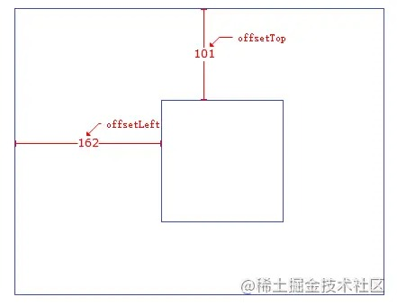
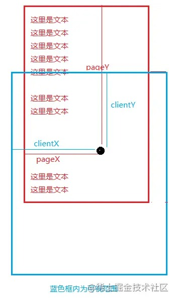

# offsetLeft、offsetTop

1. 首先二者都是只读功能，返回的是四舍五入的数字。
2. 都是以父元素作为参考（定位不能是static、没有父元素就是body）
3. `offsetLeft` 当前元素相对于父元素左边的偏移量，`offsetTop` 同理

​	

**注意：如果当前元素本身是固定定位（fixed），返回的当前元素距可视窗口的距离**

# style.top、style.left

1. 可读写
2. 返回值与offsetWith、offsetLeft 一样。
3. **它返回的是带`px`的字符串。**

**注意：如果没有明确给HTML指定过行内样式（内联样式），获取的top或left值为空**

# offsetWidth、offsetHeight

1、只读，返回值是四舍五入的数值。

offsetWidth || offsetHeight = border + padding + content (不含margin) 

# style.width、style.height

1. 可读写，返回值是带 px 的字符它是可读写的。

2. offsetWidth = style.width + style.padding + style.border

3. style.width 不含元素的边框

**注意：如果没有明确给HTML指定过行内样式（内联样式），获取的width或height值为空**

# clientWidth、clientHeight

1. 只读属性
2. 返回当前节点的可视宽高（不含边框，外边距）。

clientWidth = 左右padding + height - scrollbar.width

# scrollTop 、scrollleft

1. 可读写
2. 返回是垂直和水平滚上去的距离。

# scrollWidth、scrollHeight

1. 只读
2. 返回的是当前节点实际的宽高，
3. 没有垂直、水平滚动的时候和 clientWidth 、clientHeight 值一样。

# event.clientX/Y、event.pageX\Y

1. 都是只读
2. clientX\Y ，返回是目标点（上图黑点左上角）距离浏览器可视区域的X、Y轴坐标
3. pageX\Y，返回的是目标点距离 document 最左上角的X、Y轴坐标

# innerHeight、innerWidth

innerHeight/innerWidth为**只读属性**，返回窗口文档显示区的高度和宽度，不包括菜单栏、工具栏和滚动条的宽高。（ 注：IE不支持这些属性，它用document.documentElement 或document.body 的 clientWidth和 clientHeight属性作为替代。）

outerHeight/outerWidth为**可读写属性**，设置或返回一个窗口的高度和宽度，包括所有界面元素（如工具栏/滚动条）。

