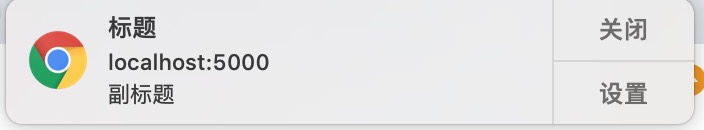

 <!-- `webpack`的劣势在哪里

+ 不适合 web 开发的初学者
+ 对于 CSS、图片和其它非 JS 资源文件时，需要先混淆处理
+ 文档变化很大，很容易过时，插件文档等于没写。
+ 插件配置较为复杂。不确定这个插件会带来哪些副作用。
+ 不能在 server 端用（ document 和 window 变量）

#### 技术选型上为什么选择`vue`，`vue`有哪些缺陷

+ Vue UI 上没有 React 支持的好。antd design。
+ 移动端支持友好。团队成员的熟悉程度。
+  Vuex 的写法，很魔法。
+ 直接在 Vue.prototype 上挂载东西，不利于编辑器的语义理解。滥用了全局注册。
+ data 维护起来比较麻烦。
+ 写法 @ ：等等。
+ mixin 等等。

####  Code Review

+ eslint 代码检查
+ 有好的方案可以畅所欲言，不在 review 讨论需求，review 就是 review
+ 明确代码规范，文件夹组织方式 redux 命名，reducer 写法等等。

#### `webpack` 针对模块化做的处理

+ webpack 并不强制你使用某种模块化方案，而是通过兼容所有模块化方案让你无痛接入项目。

#### websocket 是如何进行握手的

>http 是客户端主动发起请求，客户端收到请求作出响应，依赖客户端的请求。

浏览器和服务器之间的双向交互通信会话，无需轮询服务器以进行回复。只是一种持久化的协议（HTML5 的新特性）。和 HTTP 协议基本没有关系。是 HTTP 协议的一种补充协议。

+ 浏览器握手请求，通过 get 方法发起请求，携带一个头部信息 Sec-WebSocket-Key

  ```http
  GET /chat HTTP/1.1
  Host: server.example.com
  Upgrade: websocket // 告诉Apache、Nginx等服务器 发起的是 WebSocket 协议
  Connection: Upgrade
  Sec-WebSocket-Key: x3JJHMbDL1EzLkh9GBhXDw== // base64 随机生成
  Sec-WebSocket-Protocol: chat, superchat
  Sec-WebSocket-Version: 13
  Origin: http://example.com
  ```

+ 服务器握手响应，Sec-WebSocket-Accept: s3pPLMBiTxaQ9kYGzzhZRbK+xOo=

  ```http
  HTTP/1.1 101 Switching Protocols
  Upgrade: websocket // 告诉客户端即将升级的是Websocket协议
  Connection: Upgrade
  Sec-WebSocket-Accept: HSmrc0sMlYUkAGmm5OPpG2HaGWk= // 经服务器确认加密过的
  Sec-WebSocket-Protocol: chat
  ```

+ 作用
  + 服务端可以主动给客户端推送信息（解决了必须客户端发起请求才能响应的限制）
  + 便捷，整个前后端通信是建立在一次握手上的，一次握手解决问题。（直到断开连接）

#### 生产者消费者模式

+ emit 发射一个事件 消费者 回调监听

  ```js
  const EventEmitter = require('events').EventEmitter
  class Test extends EventEmitter{
    constructor(){
      super()
      setInterval(() => {
        // 发射事件，给外面的业务代码抛出一些东西出去
        this.emit('listen',{date:Date(),test:'2秒触发一次'})
      }, 2000);
    }
  }
  module.exports=Test
  
  // 分割
  
  const Test = require('./lib/EventEmitter') 
  const test01 = new Test 
  
  // 接收事件
  test01.addListener('listen',(res)=>{
    // 这里可以进行业务逻辑处理
    console.log(res)
  })
  ```

#### 如何批量抓取文章

`request-promise` `fs` 等模块

+ 请求网址
+ 当前网页是否存在相册
+ 创建相册目录
+ 下载保存相册
+ 请求分页网址

#### ios键盘挡住屏幕，ios输入的时候光标定位错乱

因为在IOS下fixed属性失效

+ 不用 fixed 布局，使用框架。

+ 手动计算到底有多高。

+ 定时器

  ```js
  $("input,select").blur(function(){
    setTimeout(function() {
      var scrollHeight = document.documentElement.scrollTop || document.body.scrollTop || 0;
      window.scrollTo(0, Math.max(scrollHeight - 1, 0));
    }, 100);
  })
  ```


#### WebAssembly

> WebAssembly是一个底层虚拟机，.wasm 是基于堆栈虚拟机的二进制指令格式，WebAssembly的设计目标是编译高级语言(c/c++/Rust等)，提供可移植的结果，支持部署到web端及服务端

+ 规范浏览器厂商协作；
+ JS 使用 WebAssembly 代码像导入一个模块一样简单


#### PWA 的特性

> PWA 全称 Progressive Web App，即渐进式 WEB 应用。

一个 PWA 应用首先是一个网页, 可以通过 Web 技术编写出一个网页应用. 随后添加上 App Manifest 和 Service Worker 来实现 PWA 的安装和离线等功能。

<small>PWA不是某种技术的描述，而是几种技术的合集。</small>

<small> Service Workers (chrom api) 就像介于服务器和网页之间的拦截器，能够拦截进出的HTTP 请求，从而完全控制你的网站。</small>

特点：

- 可以添加至主屏幕，点击主屏幕图标可以实现启动动画以及隐藏地址栏
- 实现离线缓存功能，即使用户手机没有网络，依然可以使用一些离线功能
- 实现了消息推送

##### Service Worker

> 和 Worker 不通，它无法被创建实例，Worker 可以，new Worker()
>
> 是注册一个 Service Worker 而不是创建一个。

以生命周期事件的形式提供 API 交互的手段。

```js
// 在 Service Worker 中你不能访问 BOM DOM 的 API
// 生命周期如下
self.addEventListener('install',e=>{
  console.log('install',e)
})

self.addEventListener('activate',e=>{
  console.log('activate',e)
})

// 捕获资源的请求 js css 等 
self.addEventListener('fetch',e=>{
  console.log('fetch',e)
})
```


服务工作线程：

+ 常驻内存运行
+ 代理网络请求
+ 依赖 HTTPS

##### Promise 

##### Notification API

**这个 API 是在页面上下文中使用的，不是在 Service Worker 中** 

**因为授权只能在页面上下文中进行**

**然后在 Service Worker 中调用 **

```js
self.registration.showNotification('Vibration Sample', {
  body: 'Buzz! Buzz!',
  icon: '../images/touch/chrome-touch-icon-192x192.png',
  vibrate: [200, 100, 200, 100, 200, 100, 200],
  tag: 'vibration-sample'
});
```

+ 消息推送

  + 依赖用户授权
  + 适合 Service Worker ，因为它常驻内存

  ```js
  // 得到授权通知的结果 
  // default 还没授权
  // granted 成功
  // denied 拒绝
  Notification.requestPermission(res=>console.log(res))
  
  
  // 拿到授权后实例化 Notification
  new Notification('标题',{body:'副标题'})
  ```

  

##### Cache API

+ 支持资源的缓存

  + 缓存资源（css、js、img）
  + 依赖 Service Worker 代理网络请求
  + 支持离线运行

  ```js
  // 在 Service Worker 中你不能访问 BOM DOM 的 API
  
  const CHCHE_V1 = 'cache-v1' // 缓存版本号
  
  // 生命周期如下
  self.addEventListener('install',e=>{
    // 有更新直接 activate
    // e.waitUntil(self.skipWaiting())
    // 每次 install  写入缓存
    e.waitUntil(caches.open(CHCHE_V1).then(cache=>{ 
      cache.addAll([
        '/', // 缓存路径
        './index.css', // 缓存资源名称
      ])
    }))
  })
  
  self.addEventListener('activate',e=>{
    // 在这里清理无效缓存
     e.waitUntil(caches.keys().then(cacheNames=>{
       return Promise.all(cacheNames.map(cacheName=>{
         if(cacheName!==CHCHE_V1){ // 历史的缓存名与当下的缓存名是否一致
          return caches.delete(cacheName)
         }
       }))
     }))
  })
  
  self.addEventListener('fetch',e=>{
    // 先查缓存没有在进行静态资源的请求
    // 这样就算你关闭服务器，命中缓存也是可以显示出页面的
    e.respondWith(caches.open(CHCHE_V1).then(cache=>{
      return cache.match(e.request).then(res=>{
        if(res){ // 命中缓存就取缓存，否则进行fetch请求
          return res
        }
        fetch(e.request).then(res=>{
          cache.put(e.request,res.clone()) // 写入缓存供下次使用
          return res
        })
      })
    }))
  })
  ```

##### 在项目中开启 PWA

借助 workbox ，create-react-app 已经配置好了 webpack  的 worke-box 插件。

src/serviceWorker.js

打包的时候会自行构建依赖缓存路径，不需要管，也不需要配置什么。直接用就行了。

#### V8 是何如执行 js 代码的

我们写的 JavaScript 代码直接交给浏览器或者 Node 执行时，底层的CPU是不认识的，也没法执行。所以在执行程序之前，需要经过一系列的步骤，将我们编写的代码翻译成机器语言。这个过程一般是由**编译器（Compiler）** 或者**解释器（Interpreter）** 来完成。

**JavaScirpt 引擎可以将 JS 代码编译为不同 CPU (Intel, ARM以及MIPS等) 对应的汇编代码**

<small>[V8](https://github.com/v8/v8)是一个非常复杂的项目，使用[cloc](https://github.com/AlDanial/cloc)统计可知，它竟然有**超过100万行C++代码**。</small>


- [Parser](https://v8.dev/blog/scanner)：解析器负责将 JavaScript 源码转换为 Abstract Syntax Tree (AST)
- [Ignition](https://v8.dev/docs/ignition)：interpreter，即解释器，负责将 AST 转换为 Bytecode，解释执行 Bytecode；同时收集 TurboFan 优化编译所需的信息，比如函数参数的类型；
- [TurboFan](https://v8.dev/docs/turbofan)：compiler，即编译器，利用 Ignitio 所收集的类型信息，将 Bytecode 转换为优化的汇编代码；
- [Orinoco](https://v8.dev/blog/trash-talk)：garbage collector，[垃圾回收](https://blog.fundebug.com/2019/07/03/javascript-garbage-collection/)模块，负责将程序不再需要的内存空间回收；
  - 主流的浏览器使用的垃圾回收算法都是基于**mark-and-sweep**（标记清除）：
    - 多线程回收，避免阻塞 js 的执行。
    - 利用浏览器空闲的时间进行垃圾回收。
    - 根据对象的生命周期长短采用不同的策略进行垃圾回收
      - str = 1000000000 10s 后 str=1 可以先进行垃圾回收再赋值。

Parser 将 JS 源码转换为 AST，然后 Ignition 将AST转换为 Bytecode，最后 TurboFan 将 Bytecode转换为经过优化的 Machine Code (实际上是汇编代码)。


#### 如何批量引入组件 Vue

**记住**全局注册的行为必须在根 Vue 实例 (通过 `new Vue`) 创建之前发生**。[这里](https://github.com/chrisvfritz/vue-enterprise-boilerplate/blob/master/src/components/_globals.js)有一个真实项目情景下的示例。**

```js
import Vue from 'vue'
import SvgIcon from '@/components/SvgIcon'// svg component

// register globally
Vue.component('svg-icon', SvgIcon)

const req = require.context('./svg', false, /\.svg$/)
const requireAll = requireContext => requireContext.keys().map(requireContext)
requireAll(req)


// 在组件中使用
 <svg-icon icon-class="user" /> // icon-class === icon 文件名
```

#### 计算白屏时间

白屏时间 = 地址栏输入网址后回车 - 浏览器出现第一个元素

<small>通常认为浏览器开始渲染 `<body>` 或者解析完 `<head>` 的时间是白屏结束的时间点</small>

```html
<!DOCTYPE html>
<html lang="en">
<head>
  <meta charset="UTF-8">
  <meta name="viewport" content="width=device-width, initial-scale=1.0">
  <title>Document</title>
  <script>
    window.pageStartTime = Date.now();
  </script>
  <link rel="stylesheet" href="xx.css">
  <script src="xx.js"></script>
</head>
<body>
  <h1>白屏时间结束</h1>
  <h2 id="result"></h2>
  <script>
    window.firstPaint = Date.now();
    document.querySelector('#result').textContent = window.firstPaint - 		  window.pageStartTime
  </script>
</body>
</html>
```

**获取精度更高的时间**

+ 浏览器使用 `performance.now()` 可以获取到 `performance.timing.navigationStart` 到当前时间之间的微秒数
+ Node.js 使用 `process.hrtime` 返回一个数组，其中第一个元素的时间以秒为单位，第二个元素为剩余的纳秒

**首屏时间**

+ H5 如果页面首屏有图片

  ```js
  首屏时间 = 首屏图片全部加载完毕的时刻 - performance.timing.navigationStart
  ```

+ 如果页面首屏没有图片

  ```js
  首屏时间 = performance.timing.domContentLoadedEventStart - performance.timing.navigationStart
  ```

  

#### DNS 查询的过程，分为哪两种，是怎么一个过程

> DNS ( Domain Name System) 是“域名系统”的英文缩写,DNS 是应用层协议 

**客户端和 DNS 服务器之间使用的是递归查询，而 DNS 服务器之间使用的是迭代查询.**

+ 递归查询时要求所请求的 DNS 服务器应答给客户端所请求的域名和 IP 的映射关系。**直到解析成功或者不成功。**
+ 迭代查询时所请求的 DNS 服务器应答给客户端的不一定是域名和 IP 地址的映射关系，也可以是另一台 DNS 服务器，让客户端再将请求发送到另一台 DNS 服务器。直到这台服务员能够返回**最佳节点**对应的域名和 IP 映射关系。
+ 本地 DNS 服务器在代替客户端向其他服务器查询时，客户端完全处于**等待状态。**

#### CDN 的原理，是如何就近分配的

> CDN（Content Delivery Network，内容分发网络）

将源站的内容发布到接近用户的网络“边缘”，用户可以就近访问数据，提高响应速度，减小源站压力。因为用户访问的是缓存节点而不是真实的源节点。

**原理：**


如果 DNS 服务器属于 CDN

DNS 在解析域名的时候会新增一个 `GSLB（全局负载均衡系统）` ，它可以根据用户的 `IP` 地址判断用户的位置，筛选出距离用户较近的 `SLB（本地负载均衡系统）` ，并将这个 `SLB` 的 `IP` 地址返回给本地的`DNS` 。

`SLB` 主要判断缓存集群服务器中是否包含用户请求的资源，然后筛选出最优的缓存节点将 `HTTP` 的请求重定向到最优的缓存节点上，缓存节点会判断请求资源是否过期，没过期就返回，过期了会请求源站在更新缓存数据再返回给用户。 -->
