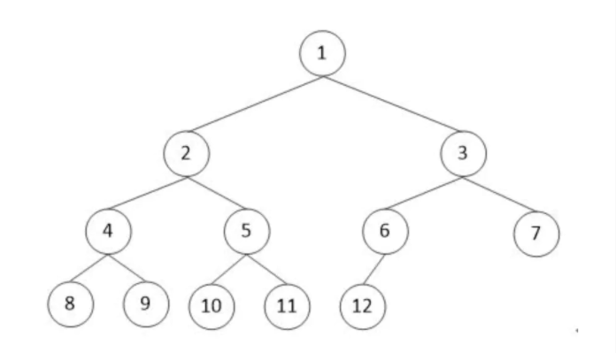

# Leetcode 

## 时间（空间）复杂度

T(n)，T为输入为 n 时候某段代码总的执行次数，n 为输入的大小或数量

```js
function fn1(){
 	console.log('1') // 执行1次
  return null // 执行1次
}
```

一共2次 T(n) = 2，如果 T(n) 等于一个常数，那么时间复杂度就是 O(1) ，一般没有循环的执行语句就是O(1)

```js
function fn2(n){
  for(let i=0;i<n;i++){ // i=0 执行1次，i<n 执行n+1次，i++ 执行 n 次
    console.log(i) // 执行 n 次
  }
  return null // 执行 1 次
}
```

一共执行 3n+3 次T(n) = 3n+3，如果 T(n) = 常数(n)+常数 ，如果n很大常数就可以忽略，那么时间复杂度就是 O(n)，一般有a层循环时间复杂度就是O(n^a) 


## 二叉树，广度优先

**树**是n个节点的有限集，n为0时称为空树。

+ 有且仅有一个根节点
+ n大于1时，其余节点可分为m个互不相交的有限集，每个集合又是一个树，称为根的子树。

**广度优先遍历**



- 前序遍历：1, 2, 4, 8, 9, 5, 10, 11, 3, 6, 12, 7
- 中序遍历：8, 4, 9, 2, 10, 5, 11, 1, 12, 6, 3, 7
- 后序遍历：8, 9, 4, 10, 11, 5, 2, 12, 6, 7, 3, 1
- 广度优先遍历：1, 2, 3, 4, 5, 6, 7, 8, 9, 10, 11, 12


思路：由于是一层一层从左至右访问并直接读取节点值，同一层中读取了某个节点的值后，其右边的节点并不一定与其有共同的父节点，所以必须用一个顺序结构来记录访问的顺序，可以推出是个先进先出的队列结构。

```js
const bfsByRcs = (tree) => {
  const queue = []
  const output = []
  const visitloop = (node) => {
    if (node) {
      output.push(node.data)
      if (node.left) {
        // [2]
        queue.unshift(node.left)
      }
      // [3,2]
      if (node.right) {
        queue.unshift(node.right)
      }
      // [3,2]
      visitloop(queue.pop())
    }
  }
  visitloop(tree)
  return output
}
```


## 链表查找倒数第n个字符

```js
const findn = (head,n) =>{
    // 慢指针 
    let result = head
    let slow = result
    let fast = result
    // 先走 n+1 步
    for (let i = 0; i < n; i++) {
      fast = fast.next
    }

    // slow fast 一起走
    while (fast.next !== null) {
      fast = fast.next
      slow = slow.next
    }

    // 得到要删除的节点
    slow.next = slow.next.next
    return result
  }
```


## 查找不重复字符串

## 给定一个无序数组求中位数

需要知道数组长度是奇数还是偶数，一般都是长度为 n 的奇数

中位数 = arr[(n-1)/2]

+ 先进行排序，快排。

  + 选一个元素作为基准
  + 所有小于基准的元素都移到左边；大于的移到右边
  + 对左边右边的两个子集不断重复第一步和第二部，直到所有的子集剩下一个元素。
  + 需要考虑长度小于1的情况；需要在操作原数组，需要 splice 求中间数

  ```js
  const quicky = arr => {
    if (arr.length <= 1) {
      return arr;
    }
    const midIndex = Math.floor(arr.length / 2);
    const midNum = arr.splice(midIndex, 1)[0]; 
    let leftArr = [];
    let rightArr = [];
    arr.forEach(item => {
      if (item < midNum) {
        leftArr.push(item);
      } else {
        rightArr.push(item);
      }
    });
    return quicky(leftArr).concat([midNum], quicky(rightArr));
  };
  ```

+ 得到排序后的数组进行求中位数 

## 数组扁平化处理

例如：

```js
// Example
let givenArr = [[1, 2, 2], [3, 4, 5, 5], [6, 7, 8, 9, [11, 12, [12, 13, [14]]]], 10];
let outputArr = [1,2,2,3,4,5,5,6,7,8,9,11,12,12,13,14,10]

// 实现flatten方法使得
flatten(givenArr)——>outputArr

```

递归：

```js
function flatten(arr){
    return arr.reduce(function(prev,item){
        return prev.concat(Array.isArray(item)?flatten(item):item);
    },[]);
}

```

拓展运算符：

```js
function flatten(arr){
    while(arr.some(item=>Array.isArray(item)){
        arr = [].concat(...arr);
    }
    return arr;
}

```

## 大数相加

```js
function add(a,b){
    // 保存最终结果
    var res='';

    // 保存两位相加的结果 和 进位值
    var c=0;

    // 字符串转数组
    a = a.split('');
		b = b.split('')
    while (a.length || b.length || c){
        // ~~ 用来把String类型 转为 Number类型
        // 把两位相加的结果 和 进位值相加
        c += ~~a.pop() + ~~b.pop();

        // 取余，把余数拼接到最终结果中
        res = c % 10 + res;

        // 保存进位，true 或者 false
        c = c>9;
    }
    return res;
}
add('11111111111111111','22222222222222222');
```

## 贪心算法

 问题能够分解成子问题来解决，子问题的最优解能递推到最终问题的最优解

```js
// 给定一个数组，它的第 i 个元素是一支给定股票第 i 天的价格。 
// （尽可能的进行交易，必须卖掉才能买进）
// 设计一个算法来计算你所能获取的最大利润(那天卖合适赚的最多)
// [7,1,5,3,6,4] 输出 7
// [1,2,3,4,5] 输出 4
// [7,6,4,3,1]输出 0
var maxProfit = function(prices) {
  let max = 0;

  for (let i = 1; i < prices.length; i++)
    if (prices[i] > prices[i - 1])
      max = max - prices[i - 1] + prices[i];

  return max;
};
```

