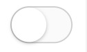

### 1. 日历选择组件

要求：

1. 能够选择最近三个月的日期，且当前月已经过去的日期不可选。

   			2. 需区分周末和工作日的显示样式，并显示当天日为”今日“。
      			3. 默认显示日期为最近三个月，修改参数可进行调整显示月数。

计划编写日、周、月三个组件进行组合显示。用 table 布局。

#### 1.1 日组件

显示几号，用 `td` 编写。用 `new Date(day).getDay()` 计算当前是周几，添加对应的样式名，用来做区分。

```jsx
function Day(props) {
  const { day, onSelect } = props;

  if (!day) {
    return <td className="null"></td>;
  }

  const classes = [];

  const now = h0();

  if (day < now) { 
    // 本月已经过去的日期不可选
    classes.push("disabled");
  }

  // 处理周六周日
  if ([6, 0].includes(new Date(day).getDay())) {
    classes.push("weekend");
  }

  const dateString = now === day ? "今天" : new Date(day).getDate();

  return (
    <td className={classnames(classes)} onClick={() => onSelect(day)}>
      {dateString}
    </td>
  );
}
```


#### 1.2 周组件

比较简单就是遍历日组件，用 `tr` 进行布局

```jsx
function Week(props) {
  const { days, onSelect } = props;

  return (
    <tr className="date-table-days">
      {days.map((day, idx) => {
        return <Day key={idx} day={day} onSelect={onSelect} />;
      })}
    </tr>
  );
}
```

返回的样式如下：


#### 1.3 月组件

相对来说比较复杂：根据月份需要传入对应月的每周的数组给周组件，然在由周组件传递具体的日期（几号）给日组件，进行渲染。

1. 根据传入的当月第一天的时间戳，计算当前月每天（+1）的时间戳。添加到数组 days。

2. 利用 `Array.fill` 对 days 进行填充。计算每月周几开始，周几结束。开始前与结束后日期留空。

   1. 周一开始那么本周不留空
   2. 周二开始那么周一留空
   3. 周三开始那么周一、周二留空。
   4. ...

3. 对 days 进行分割，拆分成周。添加到 weeks 。

   ```jsx
   function Month(props) {
     // 接收当前月的第一天的时间戳
     const { startingTimeInMonth, onSelect } = props;
   
     const startDay = new Date(startingTimeInMonth);
     const currentDay = new Date(startingTimeInMonth);
   
     let days = [];
   
     while (currentDay.getMonth() === startDay.getMonth()) {
       days.push(currentDay.getTime());
       currentDay.setDate(currentDay.getDate() + 1);
     }
     days = new Array(startDay.getDay() ? startDay.getDay() - 1 : 6)
       .fill(null)
       .concat(days);
   
     const lastDay = new Date(days[days.length - 1]);
   
     days = days.concat(
       new Array(lastDay.getDay() ? 7 - lastDay.getDay() : 0).fill(null)
     );
   
     const weeks = [];
   
     for (let row = 0; row < days.length / 7; ++row) {
       const week = days.slice(row * 7, (row + 1) * 7);
       weeks.push(week);
     }
     return (
       <table className="date-table">
         <thead>
           <tr>
             <td colSpan="7">
               <h5>
                 {startDay.getFullYear()}年{startDay.getMonth() + 1}月
               </h5>
             </td>
           </tr>
         </thead>
         <tbody>
           <tr className="data-table-weeks">
             <th>周一</th>
             <th>周二</th>
             <th>周三</th>
             <th>周四</th>
             <th>周五</th>
             <th className="weekend">周六</th>
             <th className="weekend">周日</th>
           </tr>
           {weeks.map((week, idx) => {
             return <Week key={idx} days={week} onSelect={onSelect} />;
           })}
         </tbody>
       </table>
     );
   }
   
   ```

   实现效果：

   

   

   

### 2. 单选框组件

正常效果： 选中效果：

做法：根据点击切换 `class`，利用 `span` 写成小圆点，加入进场动画。

离场：添加伪类，过渡灰色背景效果。


```jsx
export default function HighSpeed(props) {
    const { highSpeed, toggle } = props;
    return (
        <div className="high-speed">
            <div className="high-speed-switch" onClick={() => toggle()}>
                <input type="hidden" name="highSpeed" value={highSpeed} />
                <div
                    className={classnames('high-speed-track', {
                        checked: highSpeed,
                    })}
                >
                    <span
                        className={classnames('high-speed-handle', {
                            checked: highSpeed,
                        })}
                    ></span>
                </div>
            </div>
        </div>
    );
}
```

样式文件：

```scss
.high-speed {
  position: relative;
  height: 46px;
  line-height: 46px;
  display: flex;
}
.high-speed-switch {
  position: relative;
  text-align: right;
  flex: 1;
}

.high-speed-track {
  display: inline-block;
  position: relative;
  width: 50px;
  height: 30px;
  padding: 1px;
  border-radius: 16px;
  background-color: #ccc;
  vertical-align: middle;
  box-sizing: border-box;
}

.high-speed-track.checked {
  background-color: #1ba9ba;
}
// 小圆点
.high-speed-handle {
  position: absolute;
  z-index: 1000;
  top: 1px;
  left: 1px;
  width: 28px;
  height: 28px;
  border-radius: 50%;
  background-color: #fff;
  box-shadow: 0 1px 3px rgba(0, 0, 0, 0.3);
  transition: transform 0.1s ease-out;
  box-sizing: border-box;
}
// x 轴位移
.high-speed-handle.checked {
  transform: translateX(20px);
}
// 过渡灰色效果
.high-speed-track::after {
  position: absolute;
  left: 15px;
  content: ' ';
  width: 34px;
  height: 28px;
  background-color: #fafafa;
  border-radius: 0 15px 15px 0;
  transition: transform 0.13s ease-out;
}

.high-speed-track.checked::after {
  transform: scale(0);
}

```


