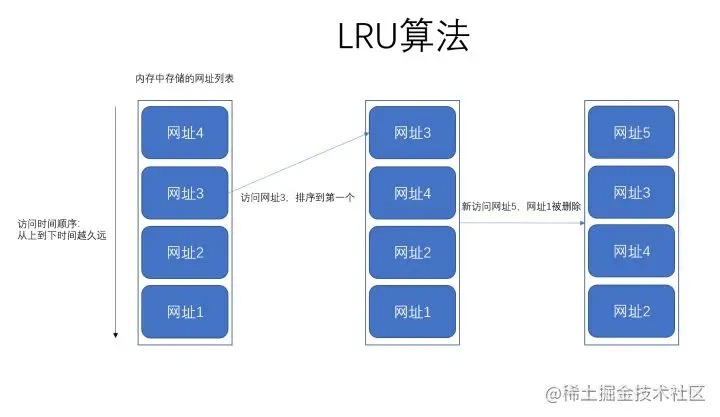
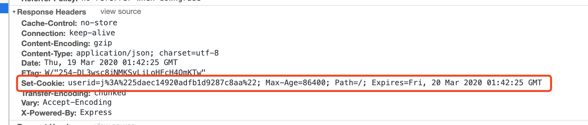
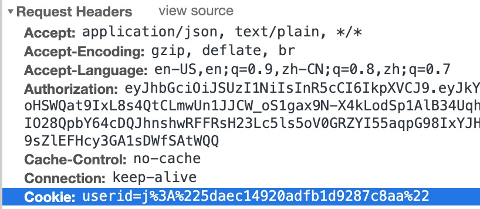
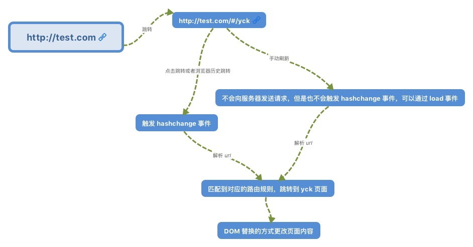
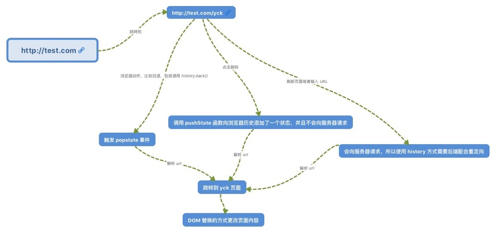
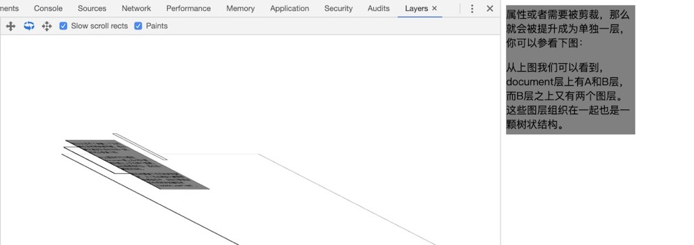
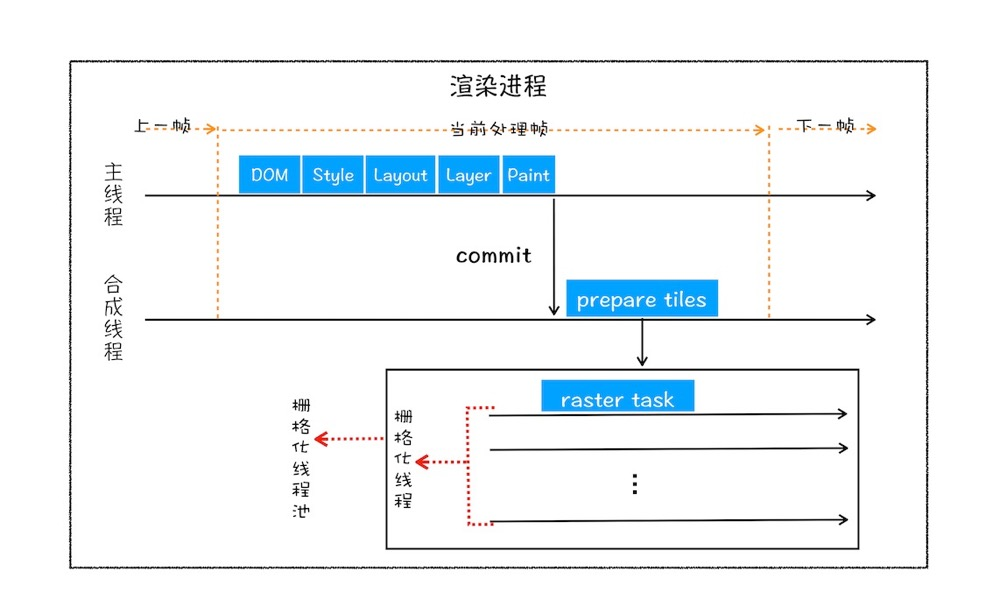
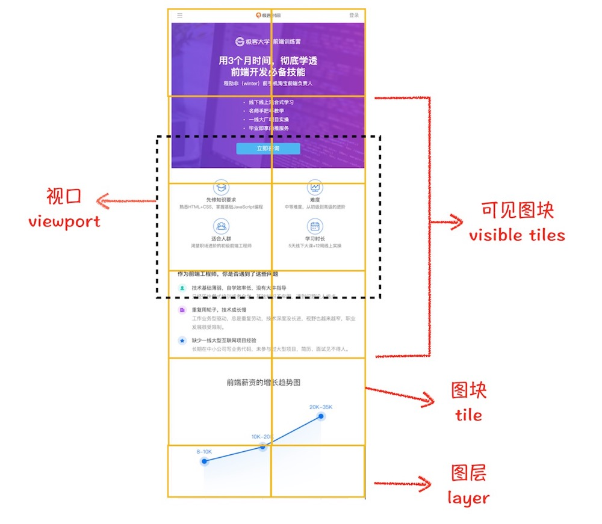
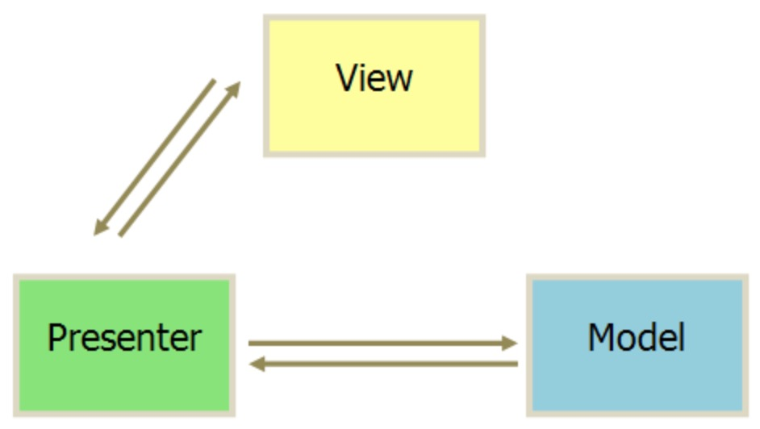

# 原生 JS

### typeof vs instanceof

二者都可以用来判断数据类型

+ typeof 返回的是一个字符串，instanceof 返回的是一个布尔值
+ typeof 可以判断除 null 外的基础类型，另外无法准确判断除 function 外的引用类型
+ instanceof 可以准确判断引用类型，但是无法判断基础类型
+ `instanceof` 运算符用于检测构造函数的 `prototype` 属性是否出现在某个实例对象的原型链上。 


# 代码实现

深拷贝

```js
function deepClone (target, hash = new WeakMap()) { // 额外开辟一个存储空间WeakMap来存储当前对象
  if (target === null) return target // 如果是 null 就不进行拷贝操作
  if (target instanceof Date) return new Date(target) // 处理日期
  if (target instanceof RegExp) return new RegExp(target) // 处理正则
  if (target instanceof HTMLElement) return target // 处理 DOM元素

  if (typeof target !== 'object') return target // 处理原始类型和函数 不需要深拷贝，直接返回

  // 是引用类型的话就要进行深拷贝
  if (hash.get(target)) return hash.get(target) // 当需要拷贝当前对象时，先去存储空间中找，如果有的话直接返回
  const cloneTarget = new target.constructor() // 创建一个新的克隆对象或克隆数组
  hash.set(target, cloneTarget) // 如果存储空间中没有就存进 hash 里

  Reflect.ownKeys(target).forEach(key => { // 引入 Reflect.ownKeys，处理 Symbol 作为键名的情况
    cloneTarget[key] = deepClone(target[key], hash) // 递归拷贝每一层
  })
  return cloneTarget // 返回克隆的对象
}
```


### 树形菜单

```js
var data = [
  { id: 1, name: "用户管理", pid: 0 },
  { id: 2, name: "菜单申请", pid: 1 },
  { id: 3, name: "信息申请", pid: 1 },
  { id: 4, name: "模块记录", pid: 2 },
  { id: 5, name: "系统设置", pid: 0 },
  { id: 6, name: "权限管理", pid: 3 },
  { id: 7, name: "用户角色", pid: 2 },
  { id: 8, name: "菜单设置", pid: 3 },
  { id: 9, name: "菜单设置", pid: 4 },
  { id: 10, name: "菜单设置", pid: 5 },
  { id: 11, name: "菜单设置", pid: 6 },
  { id: 111, name: "菜单设置", pid: 6 },
  { id: 12, name: "菜单设置", pid: 111 },
];
function toTree(data) {
  // 删除 所有 children,以防止多次调用
  data.forEach(function (item) {
    delete item.children;
  });

  // 将数据存储为 以 id 为 KEY 的 map 索引数据列
  var map = {};
  data.forEach(function (item) {
    map[item.id] = item;
  });
  //        console.log(map);
  var val = [];
  data.forEach(function (item) {
    // 以当前遍历项的pid,去map对象中找到索引的id
    var parent = map[item.pid];
    // 如果找到索引，那么说明此项不在顶级当中,那么需要把此项添加到，他对应的父级中
    if (parent) {
      (parent.children || (parent.children = [])).push(item);
    } else {
      //如果没有在map中找到对应的索引ID,那么直接把当前的item添加到 val结果集中，作为顶级
      val.push(item);
    }
  });
  return val;
}
```

### Promise

// f1为纯函数，没有任何异步逻辑
const f2 = cache(f1);
f2('abc', 123, { b: 3 });    // 5， 耗时100s
f2('abc', 123, { b: 3 });    // 5， 耗时0s

### 发布订阅模式

```js
/**
* 发布订阅模式
* 餐馆订餐，可以定不同的餐 A, B ,C
* 完成之后，通知用户取餐
* 要求：
* 1.先到先得
* 2.可以一次完成一份餐，也可以一次完成多份相同餐
*/
class CustomEvent {
  constructor() {
    this.clientList = []
  }

  // 订阅通知
  addListener(type, fn) {
    if (!this.clientList[type]) {
      this.clientList[type] = []
    }
    this.clientList[type].push(fn)
  }

  // 取消订阅
  removeListener(type) {
    if (!type) {
      this.clientList = {}
    }
    this.clientList[type] = []
  }
  // 发送通知
  trigger(types, ...args) {
    types.forEach(type => {
      const fns = this.clientList[type]
      if (!fns || fns.length < 0) {
        return
      }
      const fn = fns.shift()
      fn.apply(this, args)
    })
  }
}
```

### 实现sumFn(1)(2)

```js
/**
 * 实现sumFn(1)(2) == 3
 */

function sumFn(...rest) {

  // 参数传递的角度
  const fn = (...args) => {

    return sumFn(...rest.concat(args));
  }

  fn.valueOf = () => rest.reduce((a, b) => a + b);

  return fn;
}

console.log(sumFn(1)(2).valueOf()); // 3
console.log(sumFn(1)(2)(3).valueOf());// 6
```

### 数组按需拍平

```js	
// 实现一个 flat 方法，可以根据传入的层级展开对应深度的数组嵌套：
const flat = (arr, size) => {
  if (size > 0) {
    return arr.reduce((pre, cur) => pre.concat(Array.isArray(cur) ? flat(cur, size - 1) : cur), [])
  } else {
    return arr.slice()
  }
}
```


### js 实现 lru

> `LRU` 是一种常用的页面置换算法，选择最近最久未使用的页面予以淘汰。该算法赋予每个页面一个访问字段，用来记录一个页面自上次被访问以来所经历的时间 `t`，当须淘汰一个页面时，选择现有页面中其 `t` 值最大的，即最近最少使用的页面予以淘汰。

**场景：**

假如我们有一块内存，专门用来缓存我们最近发访问的网页，访问一个新网页，我们就会往内存中添加一个网页地址，随着网页的不断增加，内存存满了，这个时候我们就需要考虑删除一些网页了。这个时候我们找到内存中最早访问的那个网页地址，然后把它删掉。
这一整个过程就可以称之为 `LRU` 算法。

**需要考虑的点：**

- 当我们访问内存中已经存在了的网址，那么该网址是否需要更新在内存中的存储顺序。
- 当我们内存中还没有数据的时候，是否需要执行删除操作。



**代码实现**

```js
class LruCache(){
  constructor(limit){
    this.data = new Map()
    this.length = limit
  }
  get(key){
   	// 每查询一次，需要移动位置到最前面
    const data = this.data
    if(!data.has(key)){
      return null
    }
    const val = data.get(key)
    // 先删除
    data.delete(key)
    // 在重新添加 确保将该条数据移动到最前面
    data.set(key,val)
    return data.get(key)
  }
  set(key,value){
    const data = this.data
    if(data.has(key)){
      data.delete(key)
    }
    data.set(key,value)
    // 是否超过最大长度
    if(data.size>this.limit){
      // 删除
      data.delete(data.keys().next().value)
    }
  }
}
```


# 虚拟Dom

# HTTP

## HTTP 2.0

## HTTPS 加密原理 

## HTTP 缓存

## Cookie 

> Cookie（复数形态Cookies），类型为「小型文本文件」，指某些网站为了辨别用户身份而储存在用户本地终端上的数据。

#### 1.1 Cookie 有什么用？

为了解决 `HTTP` 无状态导致的问题中，客户端与服务端会话状态的问题。这个状态单指后端服务的状态而非通信协议的状态。

1. 会话状态管理（如用户登录状态、购物车、游戏分数或其它需要记录的信息）
2. 个性化设置（如用户自定义设置、主题等）
3. 浏览器行为跟踪（如跟踪分析用户行为等）

#### 1.2 Cookie 有哪些部分组成？

作为一段一般不超过 4KB 的小型文本数据，它由一个名称（Name）、一个值（Value）和其它几个用于控制 Cookie 有效期、安全性、使用范围的可选属性组成。

+ Name / Value

  + 用 JavaScript 操作 Cookie 的时候注意对 Value 进行编码处理。

+ Expirse

  + 用于设置 Cookie 的过期时间。 
  + 当 Expires 属性缺省时，表示是会话性 Cookie。关闭浏览器失效。有些浏览器提供了会话恢复功能，这样会保存 Cookie。
  + 过期的时间只与客户端相关，而不是服务端。

+ Max-Age

  + 用于设置在 Cookie 失效之前需要经过的秒数

    ```js
    res.cookie('userid', user._id, {maxAge: 1000 * 60 * 60 * 24})
    ```

  + Max-Age 可以为正数、负数、甚至是 0。

  + 如果 max-Age 属性为正数时，浏览器会将其持久化，即写到对应的 Cookie 文件中。

  + 当 max-Age 属性为负数，则表示该 Cookie 只是一个会话性 Cookie。

  + 当 max-Age 为 0 时，则会立即删除这个 Cookie。

  + 假如 Expires 和 Max-Age 都存在，Max-Age 优先级更高。

+ Domain

  + 指定了 Cookie 可以送达的主机名

  + 没有指定默认是当前主机部分（不含子域名）

    ```http
    .xxx.com
    ```

+ Path

  + Domain 和 Path 标识共同定义了 Cookie 的作用域：即 Cookie 应该发送给哪些 URL

+ Secure

  + 标记为 Secure 的 Cookie 只应通过被 HTTPS 协议加密过的请求发送给服务端

+ HTTPOnly

  + 设置 HTTPOnly 属性可以防止客户端脚本通过 document.cookie 等方式访问 Cookie，有助于避免 XSS 攻击。

+ #### SameSite

   *Chrome80 版本中默认屏蔽了第三方的 Cookie*

  + SameSite 属性可以让 Cookie 在跨站请求时不会被发送，从而可以阻止跨站请求伪造攻击（CSRF）。
    + **Strict**浏览器将只发送相同站点请求的 Cookie,当前网页 URL 与请求目标 URL 需完全一致。
    + **Lax** 允许部分第三方请求携带 Cookie
    + **None** 无论是否跨站都会发送 Cookie
  + 之前默认是 None 的，Chrome80 后默认是 Lax。

#### 1.3 如何查看 Cookie ? 

+ 可以在浏览器的开发者工具中查看到当前页面的 Cookie
+ 可以在计算机上查看本机的 Cookies 文件 (<small>以 Mac 为例</small>)
  + 路径为:`/Users/haizhi/Library/ApplicationSupport/Google/Chrome/Default`
  + 它是一个 `sqlite` 数据库文件，可以用 `sqlite` 客户端打开查看。

#### 1.4 怎么设置 Cookie

1. 客户端发送 HTTP 请求到服务器

   ```js
   // 登录
   export const reqLogin = data => request('/login', 'POST', data)
   ```

2. 当服务器收到 HTTP 请求时，在响应头里面添加一个 Set-Cookie 字段 (<small> `express` 为例</small>)

   ```js
   router.post('/login', (req, res) => {
     // if success
     res.cookie('userid', user._id, {maxAge: 1000 * 60 * 60 * 24})
   })
   ```

3. 浏览器收到响应后保存下 Cookie

   收到响应：

   

   保存 Cookie:

   

4. 之后对该服务器每一次请求中都通过 Cookie 字段将 Cookie 信息发送给服务器。

   

#### 1.5 Cookie 的缺点

+ 大小方向
+ 安全方向
+ 增加请求方向

### 请求库默认携带 cookie 的情况

+ fetch

  + `fetch` 在默认情况下, 不管是同域还是跨域`` ajax` 请求都不会带上`cookie`, 只有当设置了 `credentials` 时才会带上该 `ajax` 请求所在域的 `cookie`, 服务端需要设置响应头 `Access-Control-Allow-Credentials: true`, 否则浏览器会因为安全限制而报错, 拿不到响应

  ```js
  fetch(url, {
      credentials: "include", // include, same-origin, omit
  })
  // include: 跨域 ajax 带上 cookie
  // same-origin: 仅同域 ajax 带上 cookie
  // omit: 任何情况都不带 cookie
  ```

  

+ axios

  + `axios` 和 `jQuery` 在同域 `ajax` 请求时会带上 `cookie`, 跨域请求不会, 跨域请求需要设置 `withCredentials` 和服务端响应头

  ```js
  axios.get('http://server.com', {withCredentials: true})
  ```


# NodeJs

NodeJs默认是单线程还是多线程，单线程和多线程的适用场景?


# Vue

## Vue

### Vue 组件间的通信方式都有哪些详细说明

### 父子组件执行生命周期的优先级

### 如果列表有相等的key会引起哪些问题？

### **nextTick**

> 在同一个事件循环中，当所有的同步任务执行完毕后，就会执行 nextTick

1. nextTick 是啥 ？

   ```js
   Vue.nextTick( [callback, context] )
   ```

   在下次 DOM 更新循环结束之后执行延迟回调。

   在修改数据之后立即使用这个方法，获取更新后的 DOM。

   ```js
   this.message = 'changed'
     // DOM 还没有更新
   this.$nextTick(function () {
     // DOM 现在更新了
     // `this` 绑定到当前实例
     this.doSomethingElse()
   })
   ```

2. 为什么需要它呢？

   1. 由于 vue 的异步更新策略导致我们对数据的修改不会立刻体现在 dom 变化上。此时如果想要立即获取更新后的dom状态，就需要使用这个方法。

3. 我再什么地方用它呢？

   1. nextTick 方法会在队列中加入一个回调函数，确保该函数在前面的dom操作完成后才调用。
   2. 所以当我们想在修改数据后立即看到 dom 执行结果就需要用到 nextTick 方法。

4. 源码实现

   1. 它会在 callbacks 里面加入我们传入的函数。然后用 timerFunc 异步方式调用它们，首选的异步方式会是 Promise。

### actions 和 mutations 有什么区别

- mutation 做同步、action 做异步。

- 事实上在 vuex 里面 actions 只是一个架构性的概念，并不是必须的，说到底只是一个函数，你在里面想干嘛都可以，只要最后触发 mutation 就行。异步竞态怎么处理那是用户自己的事情

- Action 提交的是 mutation，而不是直接变更状态。 Action 可以包含任意异步操作。个人觉得这个 action 的产生就是因为 mutation 不能进行异步操作，如果有异步操作那么就用 action 来提交 mutation

### vuex 的 store 是如何注入到组件中的？

`vuex` 利用了 `vue` 的 `mixin` 机制，混合 `beforeCreate` 钩子将 `store` 注入至 `Vue` 组件实例上，并注册了 `vuex store` 的引用属性 `$store` !

### vuex 的 state 和 getter 是如何映射到各个组件实例中自动更新的？

本质上就是组件通信问题，`store` 更新后组件进行相应的更新。

`vuex` 采用了中央事件总线的方式进行通信。使各个组件只与其进行通信，达到数据同步的通信目的。


```js
let bus = new Vue({
  methods: {
    emit(event, ...args) {
      this.$emit(event, ...args)
    },
    on(event, callback) {
      this.$on(event, callback)
    },
  },
})

//component A
bus.emit("updateData", data) // 发送数据给 bus。

//component B
bus.on("updateData", (data) => {
  // 接收 updateData事件 发送的数据信息。
})
```

1.  **vuex 的 state 是借助 vue 的响应式 data 实现的。**

2.  **getter 是借助 vue 的计算属性 computed 特性实现的。**

3.  **其设计思想与 vue 中央事件总线如出一辙。**

### 前端路由原理

> 本质是监听 url 的变化，根据匹配的规则动态显示网页。

- `hash` 模式

  - 通过 `hasChange` 事件监听 `/#/` 后面 `URL` 的变化跳转到对应的页面。

    ```js
    window.location.hash = "#search"
    window.location.replace(path)
    
    function matchAndUpdate() {
      // todo 匹配 hash 做 dom 更新操作
    }
    
    window.addEventListener("hashchange", matchAndUpdate)
    ```

  - `/#/` 后 `URL` 的变化不会向服务端请求数据。

  - 手动刷新当前页面的时候不会触发 `hasChange` 事件。

- `history` 模式

  - `html5` 新模式，比 `hash` 模式美观（没有 `/#/`），又提供了 `history` API。

    ```js
    window.history.pushState(null, null, path)
    window.history.replaceState(null, null, path)
    ```

  - 通过调用 `pushState` `go` 等方法实现跳转。

  - `URl` 改变的时候会向服务端请求，所以部署的时候需要进行重定向。

### 前端路由原理

> 本质是监听 url 的变化，根据匹配的规则动态显示网页，且无需刷新。

+ `hash` 模式

  + 通过 `hasChange` 事件监听 `/#/` 后面 `URL` 的变化跳转到对应的页面。
  + `/#/` 后 `URL` 的变化不会向服务端请求数据。
  + 手动刷新当前页面的时候不会触发 `hasChange` 事件。

  

+ `history` 模式

  + `html5` 新模式，比 `hash` 模式美观（没有 `/#/`）

  + 通过调用 `pushState` `go` 等方法实现跳转。

  + `URl` 改变的时候会向服务端请求，所以部署的时候需要进行重定向。

    ```sh
     # nginx config
     location @router {
                rewrite ^.*$ /index.html break;
        }
    ```


  


## React vs Vue

> vue 和 react 的核心都是专注于轻量级的视图层，虽然只是解决一个很小的问题，但是它们庞大的生态圈提供了丰富的配套工具

#### 5.1 相同点

- 使用 Virtual DOM
- 提供了响应式 (Reactive) 和组件化 (Composable) 的视图组件。
- 将注意力集中保持在核心库，而将其他功能如路由和全局状态管理交给相关的库。

#### 5.2 不同点

##### 5.2 1 设计思想和语法

Vue 渐进式框架，基于可变数据，提供 `v-model` 指定支持双向绑定。React 主张函数式编程，单向数据流。

Vue 有模板，可以直观的编写 `html`。其中`style` 标签提供一个可选的 `scoped` 属性，为组件内的 `css` 提供作用域，控制是对当前组件有效，还是全局组件有效。

React  没有模板，推荐的写法是 `JSX + inline style` ，把所有的`html、css` 都写到`js`里。`jsx`是 `XML` 语法编写 `JavaScript` 的语法糖。

复用层面：React 可通过高阶组件，Hooks 实现，Vue 用 Mixin 实现。

过渡动画：Vue 有提供，React 原生未提供。

全局组件：Vue 声明一次就可以，React 需要一遍遍引入。

Fragments：Vue 没有（造成更多无用元素的嵌套），React 有。

##### 5.2.2 构建工具

构建工具：Vue CLI 可以根据需要删减不需要的功能，便捷，快速。

React 的 ` create-react-app` 在生成项目的时候不允许任何的配置。这也是 React 的优势。

##### 5.2.3 性能优化

Vue 组件自动实现了 ，React 的`shouldComponentUpdate` 生命周期要做的事情。

Vue 因为依赖系统的存在，当任意一个数据发生变动的时候，Vue 的每个组件都会知道自己是否需要进行重新绘制。


# 浏览器

## 输入URL到页面展示

- 用户输入url并回车
- 浏览器进程检查url，组装协议，构成完整的url
- 浏览器进程通过进程间通信（IPC）把url请求发送给网络进程
- 网络进程接收到url请求后检查本地缓存是否缓存了该请求资源，如果有则将该资源返回给浏览器进程
- 如果没有，网络进程向web服务器发起http请求（网络请求），请求流程如下：
  - 进行DNS解析，获取服务器ip地址
  - 利用ip地址和服务器建立tcp连接
  - 构建请求头信息
  - 发送请求头信息
  - 服务器响应后，网络进程接收响应头和响应信息，并解析响应内容
- 网络进程解析响应流程；
  - 检查状态码，如果是301/302，则需要重定向，从Location自动中读取地址，重新进行第4步，如果是200，则继续处理请求。
  - 200响应处理：检查响应类型Content-Type，如果是字节流类型，则将该请求提交给下载管理器，该导航流程结束，不再进行后续的渲染，如果是html则通知浏览器进程准备渲染进程准备进行渲染。
- 准备渲染进程
  - 浏览器进程检查当前url是否和之前打开的渲染进程根域名是否相同，如果相同，则复用原来的进程，如果不同，则开启新的渲染进程
- 传输数据、更新状态
  - 渲染进程准备好后，浏览器向渲染进程发起“提交文档”的消息，渲染进程接收到消息和网络进程建立传输数据的“管道”
  - 渲染进程接收完数据后，向浏览器发送“确认提交”
  - 浏览器进程接收到确认消息后更新浏览器界面状态：安全、地址栏url、前进后退的历史状态、更新web页面

## 浏览器渲染

我们输入的 `HTML`、`CSS`、`JavaScript` 经过一些子渲染阶段，最后输出像素。我们把这样的一个处理流程叫做**渲染流水线**。


按照渲染的时间顺序，流水线可分为如下几个子阶段：**构建 `DOM` 树、样式计算、布局阶段、分层、绘制、分块、光栅化和合成**。

上面的各个子阶段都有以下三个过程：

+ 每个子阶段都有其**输入的内容**
+ 每个子阶段有其**处理过程**
+ 每个子阶段会生成**输出内容**

## DOM 树构建

> DOM 是保存在内存中树状结构，可以通过 JavaScript 来查询或修改其内容。

为什么要构建？

因为浏览器无法理解和使用 `HTML` ，所以要由 `HTML`解析器解析转换为浏览器能够理解的结构—— `DOM` 树。

## 样式计算

样式计算的目的是为了计算出 `DOM` 节点中每个元素的具体样式，这个阶段大体可分为三步来完成。

### 第一 把 CSS 转换为浏览器能够理解的结构

因为浏览器也是无法理解纯文本的 `CSS` 需要经过渲染引擎把 `CSS` 转换为浏览器可以理解的结构 `styleSheets` 。

我们可以在 `chrome` 控制台输入 `document.styleSheets` 进行查看。


里面包含了 `CSS` 引入的三种方式：

+ `link` 标签引入外部 `CSS`
+ `<style></style>` 标记内部
+ 元素的`style` 属性内嵌的 `CSS`

### 第二 属性标准化进行属性的计算

```css
body { font-size: 2em; }
div {color:blue;}
p {font-wight:bold;}
```

上面的一些 `css` 的属性值 `2em`、`blue` 等这些浏览器是不认识的，需要将这些值转换为浏览器识别的标准值。这个过程就是属性标准化。

```css
body { font-size: 20px; }
div {color:rgb(0,0,255);}
p {font-wight:700;}
```

### 第三  计算出 DOM 树中每个节点的具体样式

通过**继承**的方式，来为每个节点设置其样式，按上面的来说 `body`的所有子元素的 `font-size` 都是`20px` 大小。

通过**层叠**来合并多个源的属性值。

另外如果你不提供任何样式，浏览器会给元素提供默认样式。

## 布局阶段

现在我们已经有了浏览器可以识别的 `DOM`树和 `DOM` 树中元素的样式，但是还需要知道 `DOM` 元素的几何位置就是它的坐标，我们才能把 `DOM` 树显示出来。

计算 `DOM` 树坐标的过程就是布局。

### 第一 创建布局树

因为 `DOM` 树会包含一些**不可见的元素**，如`display:none` 的元素。所以在显示之前，我们还要额外地构建一棵**只包含可见元素布局树**。

创建布局树过程如下：

+ 遍历 `DOM` 树中的所有可见节点，并把这些节点添加到布局树中。

### 第二 布局计算

到现在我们已经有了一课完整的布局树。开始元素坐标的计算

如果下载 CSS 文件阻塞了，会阻塞 DOM 树的合成吗？会阻塞页面的显示吗？会。

## 分层

我们现在有了带有元素坐标的布局树，是否可以开始绘制了，答案是否定的。

因为页面会有一些复杂的效果，如：`3D` 变换、页面滚动、或者 `z-index` `z` 轴排序等。

为了更加方便的实现这些效果，**浏览器渲染引擎会在特定的节点生成专门渲染它们的图层，并生成一颗对应的图层树**。这些图层叠加在一起最终生成了我们看到的页面图像。

打开 `Chrome` 的“开发者工具”，选择“`Layers`”标签


这些图层叠加在一起就形成了最终的页面。

并不是每个节点都对应一个图层，如果一个节点没有图层那么它就从属父节点的图层。

节点在什么情况才有自己对应的图层？

**第一 具有层叠上下文的元素会被单独提到一层**


定位、透明度、滤镜等都有层叠上下文属性。

**第二 需要剪裁（clip）的地方也会被创建为图层。**

什么是剪裁？

当元素的显示内容的区域大小，超出包含它的元素的时候，产生滚动条的时候，

渲染引擎会把裁剪文字内容的一部分用于显示在 `div` 区域。



超出的部分在下面需要移动滚动条查看。

## 绘制

在完成分层后，渲染引擎会对图层树中的每个图层进行绘制。

渲染引擎是如何绘制的呢？

如果给你一张白纸让你画成，背景是蓝色，中间有个红色的圆圆上有个白色的➕号，你怎么画？

是不是也是一步一步的画，先画这个在画那个。

渲染引擎实现图层的绘制与之类似，**渲染引擎会把一个图层的绘制拆分成很多小的绘制指令，然后再把这些指令按照顺序组成一个待绘制列表**。



每个指令做的事情都很简单，如绘制一条线，或者一个矩形等。

我们实际体验一下浏览器中的绘制：

绘制整个 `document` 需要 `3.60ms` 


## 栅格化（raster）操作

上面的绘制操作只是用来记录绘制顺序和绘制指令的列表，而**真正的绘制操作是由渲染引擎中的合成线程来完成的**。

当图层的绘制操作列表完成以后，主线程会把该绘制列表提交给合成线程，那么合成线程拿到绘制列表会怎么做呢？

`viewport`（视口）：屏幕上页面的可见区域。

通常呢一个页面很大，浏览器的视口根本放不下，我们用户只能看到一部分，我们看到的那个部分叫做视口。

这个时候呢聪明的浏览器觉得全部绘制开销太大，而且用户也看不到那么多。基于这个原因合成线程会将图层划分为图块，这些图块的大小通常是 256x256 或者 512x512，如下图所示：



然后**合成线程会优先绘制视口附近的图块来优先生成位图，实际生成位图的操作是由格栅化来执行的，所谓格栅化，是指将图块转化为位图。**而图块是格栅化的最小单元，渲染进程维护了一个格栅化的线程池，所有的图块格栅化都是在线程池中进行的。


通常，栅格化过程都会使用 `GPU` 来加速生成，使用 `GPU` 生成位图的过程叫快速栅格化，或者 `GPU` 栅格化，生成的位图被保存在 `GPU` 内存中。

因为 `GPU` 操作是在 `GPU` 进程中，如果栅格化操作使用了 `GPU`，那么最终生成位图的操作是在 `GPU` 中完成的，这就涉及到了跨进程操作。

## 合成和显示

一旦所有图块都被光栅化，合成线程就会生成一个绘制图块的命令——“DrawQuad”，然后将该命令提交给浏览器进程。浏览器进程里面有一个叫 viz 的组件，用来接收合成线程发过来的 DrawQuad 命令，然后根据 DrawQuad 命令，将其页面内容绘制到内存中，最后再将内存显示在屏幕上。到这里，经过这一系列的阶段，编写好的 HTML、CSS、JavaScript 等文件，经过浏览器就会显示出漂亮的页面了。

**合成完毕通知浏览器，浏览器进程将页面内容绘制到内存里面，最后将内存的页面显示在屏幕上。**

## 总结


<center>完整的渲染流水线示意图</center>

+ 渲染进程将 HTML 内容转换为能够读懂的 DOM 树结构。
+ 渲染引擎将 CSS 样式表转化为浏览器可以理解的 styleSheets，计算出 DOM 节点的样式。
+ 创建布局树，并计算元素的布局信息。
+ 对布局树进行分层，并生成分层树。
+ 为每个图层生成绘制列表，并将其提交到合成线程。
+ 合成线程将图层分成图块，并在光栅化线程池中将图块转换成位图。
+ 合成线程发送绘制图块命令 DrawQuad 给浏览器进程。
+ 浏览器进程根据 DrawQuad 消息生成页面，并显示到显示器上。

## “重排” “重绘” 和 “合成”

### 更新了元素的几何属性（重排）


<center>更新元素的几何属性</center>

当我们通过 JS 修改元素的宽高的时候，浏览器会触发重新布局，这个过程叫做重排，重排需要更新完整的渲染流水线（ DOM  后的步骤），所以开销也是最大的。

### 更新元素的绘制属性（重绘）

例如通过 `JavaScript` 改变文本的颜色。


<center>更新元素背景</center>

从上图可以得知在没有改变元素几何信息的前提下，可以跳过布局、分层阶段直接到绘制阶段。

相较于重排操作，**重绘省去了布局和分层阶段**，所以执行效率会比重排操作要高一些。

### 直接合成阶段

我们用 `CSS`的 `transform` 来实现动画效果，这个时候我们没有改变宽高，也没有改变颜色等，这样就可以避开重绘和重排，直接在非主线程上进行合成动画操作，这样效率是最高的。


<center>避开重排和重绘</center>

上图我们可以得知合成的时候跳过了布局、分层、绘制的过程直接进入到非主线程。不占用主线程的资源。

减少重排重绘, 方法很多：

+ 使用 class 操作样式，而不是频繁操作 style
+  避免使用 table 布局
+  批量dom 操作，例如 createDocumentFragment，或者使用框架，例如 React
+  Debounce window resize 事件
+ 对 dom 属性的读写要分离
+  will-change: transform 做优化

## 浏览器事件循环

浏览器每个渲染进程都有一个主线程，主线程非常的繁忙，既要处理 `DOM` 又要计算样式，还要处理布局，同时还要处理 `JavaScript` 任务以及各种输入事件。为了让这些任务在主线程有条不紊的运行， 这就需要一个系统来统筹调度这些任务，所以就出现了消息队列和事件循环系统。

### 消息队列和事件循环

我们可以使用单线程处理事先安排好的任务：

```js
// 线程的一次执行
const a = 1+1 // 任务一
const b = 1+2 // 任务二
console.log(a,b) // 任务三
```

但是并不是所有的任务都是事先安排好的，如果这个时候给上面的线程添加一个任务，在运行的时候产生了一个新任务，那么线程就不知道怎么执行了。

**要想在线程运行过程中，能接收并执行新的任务，就需要采用事件循环机制**

**子线程如何和主线程通信，就需要用到消息队列，它是一种数据结构**


主线程循环读取消息队列中的任务，并执行该任务，主线程就这样一直循环执行下去，只要消息队列中有任务，主线程就会去执行。

所以如果有其它线程想要发送任务让主线程执行，只需要把该任务添加到该消息队列中就可以了。

<small>由于是多个线程操作同一个消息队列，所以在添加任务和取出任务时还会加上一个同步锁。</small>


**渲染进程专门有一个 IO 线程用来接收其他进程传进来的消息**,达到浏览器进程间通信的目的。浏览器是多线程+多进程的。


### 消息队列中的任务类型

如输入事件（鼠标滚动、点击、移动）、微任务、文件读写、webSocket、JavaScript 定时器等。

页面事件 JavaScript 执行、解析、DOM、样式计算、布局计算、CSS 动画。

上面的这些事件都是在主线程中执行的，需要在写代码的时候衡量这个事件执行占用的时长，想办法解决单个任务占用主线程较久的问题。

### 页面单线程的缺点

#### 如何处理优先级高的任务

因为消息队列是 `先进先出` ，执行完上一个任务才能执行下一个任务。如果某个任务执行 `DOM` （触发其它任务塞进来），就会拉长这个任务的执行时间卡住不往下进行。

如果改成异步事件，添加到消息队列的末尾，就会发生时效性的问题，因为前面会有其它的同步任务，需要等到其它任务执行完才能执行这个任务。

这个时候**微任务**就出现了。

我们通常把消息队列中的任务成为**宏任务**。每个宏任务都包含一个**微任务队列**，在执行宏任务的过程中如果 `DOM` 有变化，会添加到微任务（异步回调代码）中，这也不会影响宏任务的继续执行。

等这个宏任务的主要功能都执行完，渲染引擎不会去立即执行下一个宏任务，而是执行当前宏任务中的微任务，这样就解决了上述问题。

<small>部分css3的动画效果是在合成线程上实现的，不需要主线程介入，所以省去了重排和重绘的过程，这就大大提升了渲染效率。JavaScript都是在在主线程上执行的，所以JavaScript的动画需要主线程的参与，所以效率会大打折扣！</small>

#### 如何解决单任务处理时间久的问题

因为所有的任务都是在单线程中执行的，每次只能执行一个任务，其它的任务都是等待的状态。前一个任务执行很久，后一个任务就要一直等着。


## web性能优化 


##### H5 秒开优化分析

需要解决的点：

1. 打开一个 H5 页面需要做一系列处理，
   1. 初始化 webview 
   2. 请求页面 
   3. 下载数据 
   4.  解析HTML 
   5. 请求 js/css 资源 
   6. dom 渲染 
   7. 解析 JS 执行
   8.  JS 请求数据 
   9.  解析渲染
   10. 下载渲染图片
2. 以上等待这些处理的过程，用户看到的都是白屏。秒开就是为了解决这个过程的耗时。


**如何解决**

传统的方式：

1. **降低请求量：**合并资源，减少 HTTP 请求数，minify / gzip 压缩，webP，lazyLoad。
2. **加快请求速度：**预解析DNS，减少域名数，并行加载，CDN 分发。
3. **缓存：**HTTP 协议缓存请求，离线缓存 manifest，离线数据缓存localStorage。
4. **渲染：**JS/CSS优化，加载顺序，服务端渲染，pipeline。

**客户端优化**

HTML缓存、离线包、等，例如可以配置一个预加载列表，在APP启动或某些时机时提前去请求，这个预加载列表需要包含所需 H5 模块的页面和资源，还需要考虑到一个H5模块有多个页面的情况，这个列表可能会很大，也需要工具生成和管理这个预加载列表。

缓存/预加载/并行，缓存一切网络请求，尽量在用户打开之前就加载好所有内容，能并行做的事不串行做。这里有些优化手段需要做好一整套工具和流程支持，需要跟开发效率权衡，视实际需求优化。


URL 输入发生点啥

+ DNS 解析过程
+ HTML词法分析和语法分析，CSS解析
+ 合成图层、合成线程调用光栅化线程池，生成位图后浏览器进程间通信过程，显卡缓存与显示器的关系

# MVC MVP 和 MVVM

#### 2.1 MVC

*MVC 的意思就是软件可以划分为 3 部分*

+ 视图（View）：用户界面。
+ 控制器（Controller）：业务逻辑
+ 模型（Model）：数据保存

通信流程为：View--Controller--Model--View 循环进行，**所有通信都是单向的**。

1. View 传送指令到 Controller
2. Controller 完成业务逻辑后，要求 Model 改变状态
3. Model 将新的数据发送到 View，用户得到反馈

#### 2.2 MVP

MVP 模式将 Controller 改名为 Presenter（主持人），同时改变了通信方向。



1. 各部分之间的通信，都是双向的。

2. View 与 Model 不发生联系，都通过 Presenter 传递。

3. View 非常薄，不部署任何业务逻辑，称为"被动视图"（Passive View），即没有任何主动性，而 Presenter 非常厚，所有逻辑都部署在那里。

#### 2.3 MVVM

MVVM 模式将 Presenter 改名为 ViewModel，基本上与 MVP 模式完全一致。

唯一的区别是，它采用双向绑定（data-binding）：View的变动，自动反映在 ViewModel，反之亦然。


